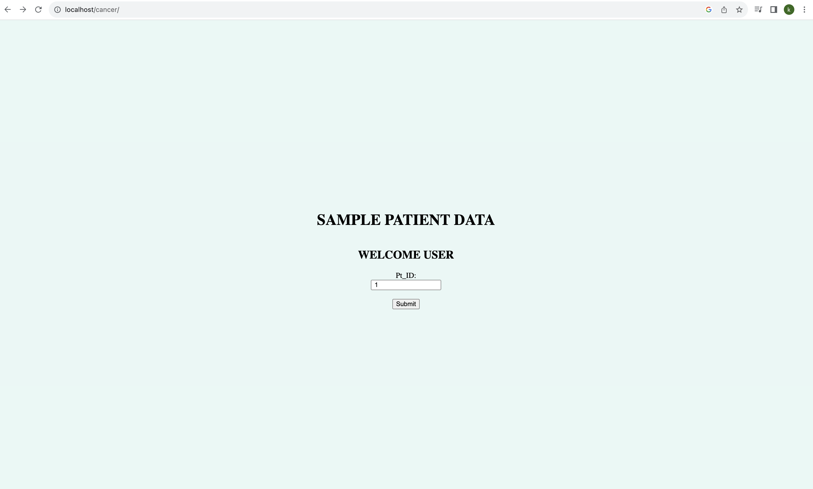
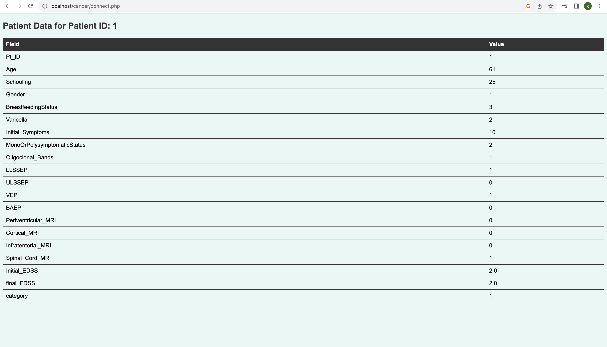

# Cancer_DB
This is a sample cancer database I created using an online database from Kaggle, mySQL workbench  and XAMPP. The goal of this project was to obtain patient information based on patient ID. 

